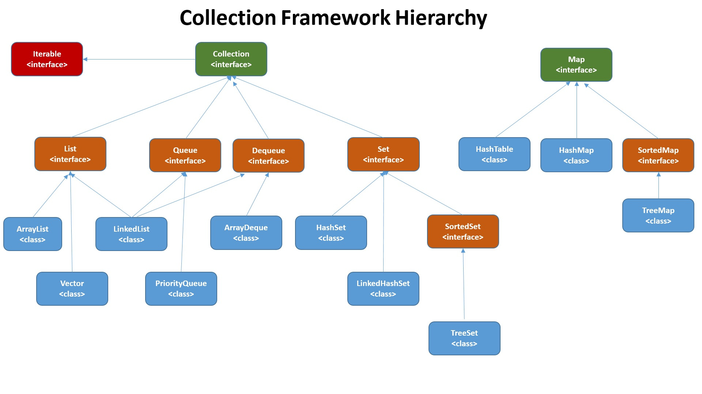

# Collections Framework and Map

**Java Collections Framework (JCF)** представляет собой архитектуру для хранения и обработки групп объектов. Она
предоставляет унифицированные интерфейсы и классы для различных типов коллекций, что позволяет разработчикам выбирать
наиболее подходящие структуры данных для своих задач без необходимости реализовывать их с нуля.



## Преимущества JCF

- **Унификация:** Общие интерфейсы и абстракции для различных коллекций.
- **Типобезопасность:** Использование Generics позволяет избежать ошибок типов во время компиляции.
- **Гибкость и расширяемость:** Легко заменять реализации коллекций без изменения кода, использующего их. Легко заменять
  реализации коллекций без изменения кода, использующего их.
- **Оптимизированные алгоритмы:** Встроенные методы сортировки, поиска и других операций.

## Интерфейс ```Collection<E>```

**Интерфейс** ```Collection<E>``` является фундаментальным компонентом Java Collections Framework (JCF). Он служит
базовым интерфейсом для всех обобщенных коллекций в Java, предоставляя общий набор методов для работы с группами
объектов. Понимание ```Collection<E>``` критически важно для эффективного использования различных типов коллекций, таких
как ```List```, ```Set```, и ```Queue```.

### Ключевые характеристики Collection<E>

- **Обобщенность (Generics):** Позволяет коллекции быть типобезопасными, то есть хранить только объекты определенного
  типа.
- **Типобезопасность:** Предотвращает ошибки времени выполнения, связанные с неправильным приведением типов.
- **Унификация:** Обеспечивает единый набор методов для различных типов коллекций.

### Архитектура и наследование

```Collection<E>``` находится на вершине иерархии интерфейсов JCF. От него наследуются более специализированные
интерфейсы, которые добавляют дополнительные возможности и специфику поведения. Также ```Collection<E>``` расшиярет
интефрейс ```Iterable<E>```.

- ```Iterable<E>```: Базовый интерфейс, определяющий метод ```iterator()```, который возвращает ```Iterator<E>```.
- ```Collection<E>```: Расширяет ```Iterable<E>```, добавляя методы для управления коллекцией элементов.
- ```List<E>```, ```Set<E>```,``` Queue<E>```: Специализированные интерфейсы, расширяющие ```Collection<E>``` и
  добавляющие специфичные методы и поведение.

### Основные методы интерфейса ```Collection<E>```

#### Добавление элементов

```
boolean add(E e);
```

Добавляет указанный элемент в коллекцию, если он еще не присутствует. Возвращает ```true```, если коллекция изменилась.

```
boolean addAll(Collection<? extends E> c);
```

Добавляет все элементы из указанной коллекции в текущую коллекцию. Возвращает ```true```, если коллекция изменилась.

#### Удаление элементов

```
boolean remove(Object o);
```

Удаляет один экземпляр указанного элемента из коллекции, если он присутствует. Возвращает ```true```, если коллекция
изменилась.

```
boolean removeAll(Collection<?> c);
```

Удаляет из коллекции все элементы, которые присутствуют в указанной коллекции. Возвращает ```true```, если коллекция
изменилась.

#### Проверка наличия элементов

```
boolean contains(Object o);
```

Проверяет, содержит ли коллекция указанный элемент. Возвращает ```true```, если элемент присутствует.

```
boolean containsAll(Collection<?> c);
```

Проверяет, содержит ли коллекция все элементы из указанной коллекции. Возвращает ```true```, если все элементы
присутствуют.

#### Размер и состояние коллекции

```
int size();
```

Возвращает количество элементов в коллекции.

```
boolean isEmpty();
```

Проверяет, пустая ли коллекция. Возвращает true, если коллекция не содержит элементов.Проверяет, пустая ли коллекция.
Возвращает ```true```, если коллекция не содержит элементов.

#### Очистка коллекции

```
void clear();
```

Удаляет все элементы из коллекции.

#### Итерация по коллекции

```
Iterator<E> iterator();
```

Возвращает итератор для последовательного доступа к элементам коллекции.

```
Spliterator<E> spliterator();
```

Возвращает ```Spliterator```, позволяющий параллельную обработку элементов коллекции.

#### Остальные методы

Есть ещё несколько методов которые присуще интерфейсу ```Collection<E>```. 